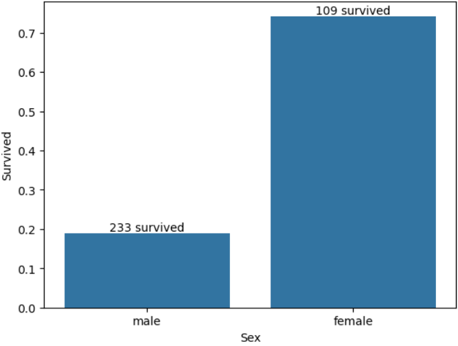
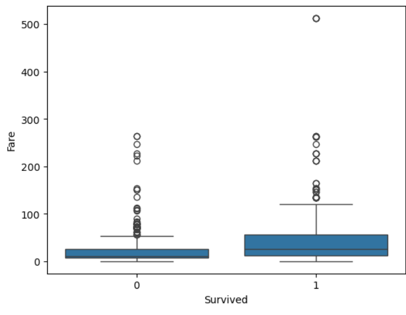
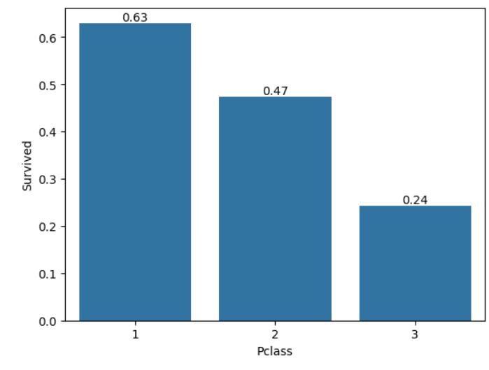
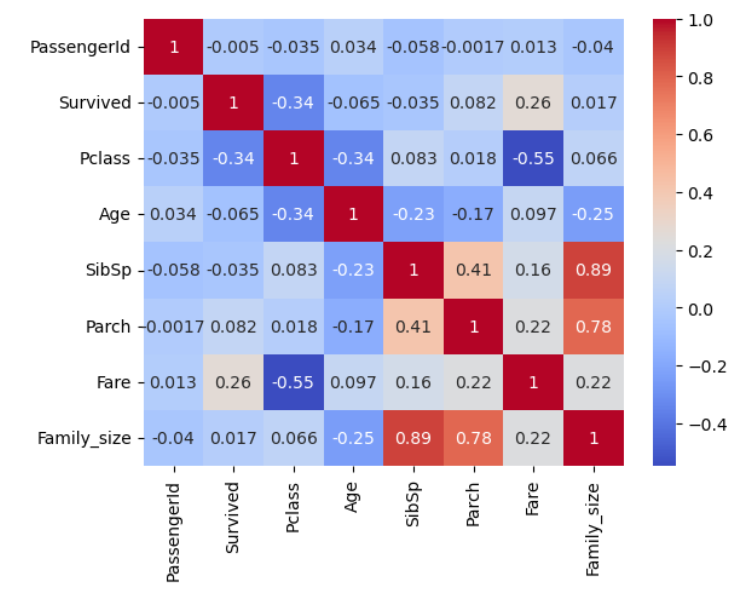

## 🚢 Titanic Survival Analysis (EDA)
## 📌 Project Overview

This project performs Exploratory Data Analysis (EDA) on the Titanic dataset to identify key factors that influenced passenger survival during the disaster.

The analysis focuses on understanding how demographic characteristics, socio-economic status, and family structure affected survival outcomes.

---

## 📂 Dataset Information

Source: Titanic Train Dataset (train.csv)

Total Rows: 891

Total Columns: 12

---

## 🧹 Data Cleaning Process

The following preprocessing steps were performed:

Checked dataset structure using .info()

Identified missing values:

Age: 177

Cabin: 687

Embarked: 2

Checked for duplicates using PassengerId (none found)

Dropped irrelevant columns:

Ticket

Cabin

Handled missing values:

Replaced Age null values with median (right-skewed distribution)

Converted Age from float to integer

Replaced Embarked null values with mode ("S")

Extracted Title from Name column

Standardized titles (Mlle, Mme, Ms → Mrs)

Grouped rare titles into "Rare"

This marked the completion of data cleaning.

---

## 📊 Exploratory Data Analysis (EDA)

The following analyses were conducted:

Survived vs Non-Survived distribution

Gender distribution

Age distribution

Survival rate by Sex

Survival rate by Passenger Class (Pclass)

Fare vs Survival (Boxplot analysis)

Survival rate by Embarked

Family Size vs Survival

Survival rate by Pclass and Sex

Survival rate by Title

Correlation analysis

---

```
## 📁 Recommended Repository Structure
titanic-survival-eda/
│
├── README.md
│
├── train.csv
│
├── notebooks/
│   └── titanic_analysis.ipynb
│
├── images/
    ├── survival_by_gender.png
    ├── fare_vs_survival_boxplot.png
    ├── survival_by_pclass.png
    └── correlation_heatmap.png

```

---

## 📊 Dashboard Preview  

### 1️⃣ Survival by gender 


---

### 2️⃣ Fare by Survival


---

### 3️⃣ Survival by Pclass  


---

### 3️⃣ Correlation heatmap  


---

## 🔎 Key Insights
👩 Gender as a Major Determinant

577 males and 314 females onboard

Female survival rate ≈ 79%

Male survival rate ≈ 19%

Gender was one of the strongest predictors of survival.

---

💰 Socio-Economic Status (Fare & Class)

Passengers in First Class had higher survival rates

Survivors generally paid higher fares

Median fare for survivors was significantly higher

Fare showed positive correlation with survival (0.26)

Pclass showed moderate negative correlation with survival (-0.34)

Higher fare → Higher class → Better survival chance.

---

👨‍👩‍👧 Family Structure

Small families (2–4 members) had the highest survival rates

Solo travelers had lower survival rates

Large families had the lowest survival probability

Moderate family size increased survival likelihood.

---

📉 Correlation Summary

Gender strongly influenced survival

Fare positively associated with survival

Passenger class moderately associated

Age showed minimal independent impact

Family-related variables showed weak correlation

---

## 🛠 Tools & Libraries Used

Python

Pandas

NumPy

Matplotlib

Seaborn

---

## 🎯 Conclusion

The analysis reveals that survival during the Titanic disaster was significantly influenced by:

Gender

Socio-economic status (Fare & Class)

Family size

The findings suggest that rescue priority was not random but strongly associated with gender and class-based hierarchy.
